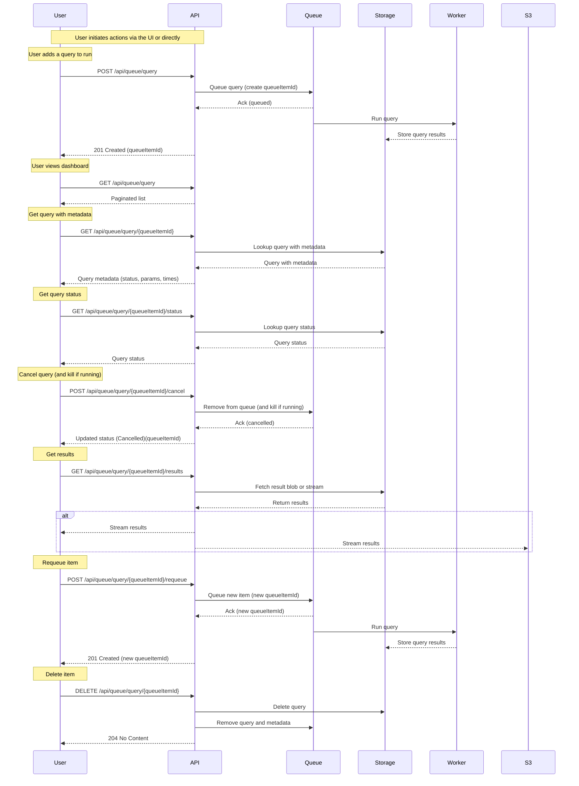

# Query Queue & Results Spec

## Overview

This document describes user and admin requirements for the query queue and results storage for IMQueryRunner. It captures user stories, per-item behaviour, and the recommended storage schema for query results.

## User stories

As a user

- I want to add a query to my queue.
- I want to see all added queries to my queue in a dashboard.

[queueItemId]

- I want to see meta information about a specific query (status, parameters, date/time added, execution time, priority, etc.).
- I want to stop a query: cancel it (while it's queued) or kill it (while it's running).
- I want to delete a query from the queue (history).
- I want to get the results of a query.
- I want to requeue a query.

As an admin

- I want to do everything a user can do (all above).
- I want to see all queues.
- I want to see all queries from all users.

[queueItemId]

- I want to stop other users' queries.
- I want to delete other users' queries.
- I want to see other users' query results.

## Operations (API / UI)

- Add query: Submit query with parameters and target queue; returns `queueItemId`.
- List queries: returns paginated list for the user (admins can request all users).
- Get queue item: metadata for `queueItemId`.
- Cancel queued item: mark as Cancelled and remove from work queue before execution or Kill running item: attempt to terminate running process and mark as Cancelled/Failed appropriately.
- Delete item: remove metadata.
- Get results: stream or download the results for `queueItemId`.
- Requeue: readd queue item with the same parameters and a new `queueItemId`.

Permissions

- Users may operate only on their own queue items.
- Admins have full privileges across all queues and users.

## Results storage model (MySQL)

All results should be stored in a single MySQL table. This provides a central place for lookups and efficient querying.

Recommended table: `query_results`

Example DDL (illustrative):

```sql
CREATE TABLE query_results (
  hashcode VARCHAR(128) NOT NULL,
  iri VARCHAR(512) NOT NULL,
  PRIMARY KEY (hashcode, iri),
);
```

## Flowchart


